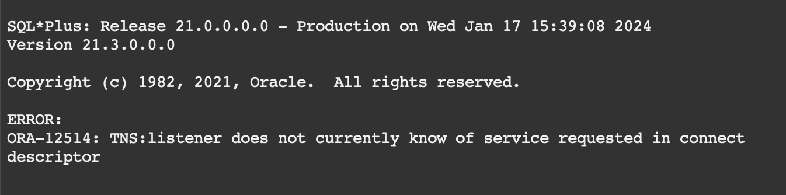
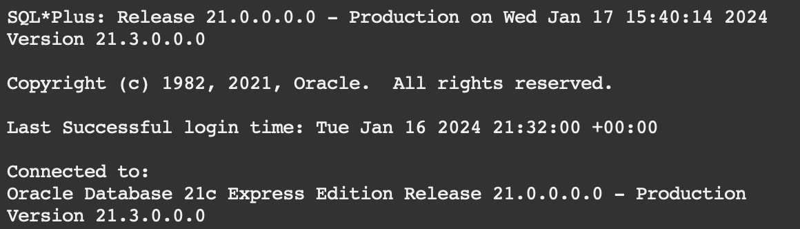

This document describes the issues which may be faces when deploying Oracle 21c from container

# Error while connection to database from the outside of connector ORA-12514: TNS:listener does not currently know of service requested in connect descriptor

## Issue

When you can succesfully connect from the container by using the sqlplus, can perform any operation inside, including setting up users/schemas, changing passwords, creation of the objects, but the connection from outside of container fails with the error


Also valid for
`ORA-12505, TNS:listener does not currently know of SID given in connect descriptor`

## Resolution

Test 3 commands:

```
sqlplus system/system-password@XE
sqlplus system/system-password
sqlplus / as sysdba
```

If 1st doesn't work, but 2nd and 3rd do work, then the issue is with listner. To fix it, do the following:

```
sqlplus /nolog
conn system
alter system set local_listener = '(ADDRESS=(PROTOCOL=TCP)(HOST=localhost)(PORT=1521))' scope = both;
alter system register;
exit
lsnrctl status
```

Test it back with command #1. Connection now should be successful.

