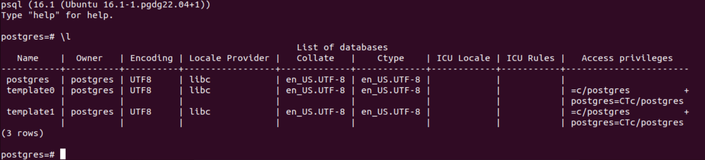
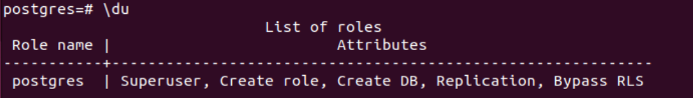

# Introduction

This article shows the basic steps for deployment of the PostgreSQL on Ubuntu v22

# Deployment

## Deployment using APT-GET

Source documentation for intall
Source documentation for install can be found by the link
https://www.postgresql.org/download/ with selection of the required operational system or directly for Ubuntu by the link https://www.postgresql.org/download/linux/ubuntu/

Must have requirement is the functional internet connection.
Then the following steps should be taken

### Create the file repository configuration:

```
sudo sh -c 'echo "deb https://apt.postgresql.org/pub/repos/apt $(lsb_release -cs)-pgdg main" > /etc/apt/sources.list.d/pgdg.list
```

### Import the repository signing key:

```
wget --quiet -O - https://www.postgresql.org/media/keys/ACCC4CF8.asc | sudo apt-key add -
```

### Update the package lists:

```
sudo apt-get update
```

### Install the latest version of PostgreSQL.

If you want a specific version, use 'postgresql-12' or similar instead of 'postgresql':

```
sudo apt-get -y install postgresql
```

## Configuration of PostgreSQL

```
cat /etc/postgreSQL/16/main/postgresql.conf
```

The path shown above is for version 16 of PostgreSQL. You may need to change it according to your current setup.
Edit the file with admin privileges

```
sudo vm /etc/postgreSQL/16/main/postgresql.conf
```

Change the line of listener to the following:

```
listen_addresses = '*'
```

If cursor doesn't move but brings letters A B C D on the screen instead, simply use

```
:set nocompatible
```

in the vm terminal.

Recognize the port number in the next line for connection to database. In my case that is 5432.
Modify the file '/etc/postgreSQL/16/main/pg_hba.conf'
Add the following to the bottom

```
host    all all 0.0.0.0/0   md5
```

for MD5 encrypted password, or use the default 'scram-sha-256' value instead

Restart PostgreSQL by

```
systemctl restart postgresql
```

Check if PostgreSQL is up and running, listening on the port 5432

```
ss -nlt | grep 5432
```

Expected result is:


## Check existing databases and set default password

The default created user is 'postgres'. Connect to postgreSQL and browse existing databases

````
sudo -u postgres psql
\l ```(backslash low case L)

````

list users

````
\du
```

The default user doens't have the password. You have to setup it before start using database.
```

\password postgres

```

```

## Connect to your database

After steps above have been complete you should be able to use the preferred tool to connect to the database using IP address, database name "postgres", port "5432", user "postgres" and your password for this user
````
